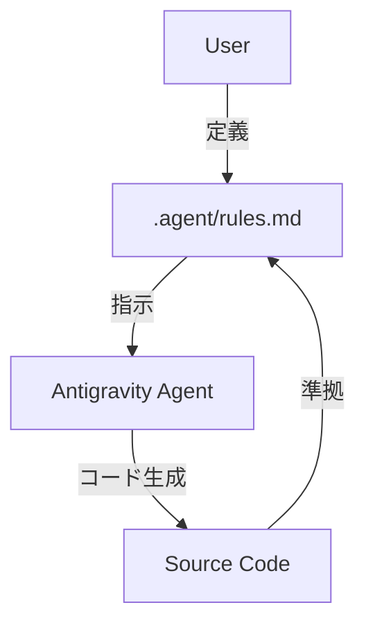
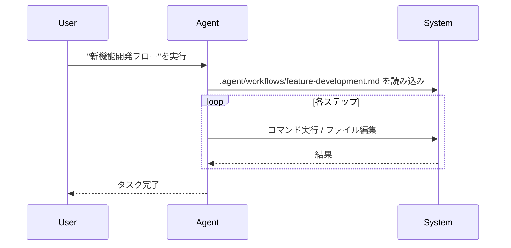

# GoogleのAIエディタ「Antigravity」を触ってみた！設定やワークフローも解説

## はじめに

Googleが2025年11月18日に発表した新しいAIエディタ「**Antigravity**」。
「重力から解放されたかのような軽快なコーディング体験」を謳うこのエディタ、気になっている方も多いのではないでしょうか？

今回は、実際にAntigravityを使って簡単なアプリ開発を試してみた感想と、Antigravityの真骨頂とも言える「**プロジェクト固有のルール設定**」や「**ワークフロー機能**」について深掘りして解説します！

## Antigravityとは？

Antigravityは、Googleが開発した次世代のAIネイティブエディタです。
単なるコード補完だけでなく、**「Agent」**と呼ばれるAIアシスタントが開発プロセス全体をサポートしてくれるのが最大の特徴です。

主な特徴は以下の通り：

*   **Agentic AI**: 指示を出すだけで、計画・実装・検証まで自律的に行ってくれる
*   **Context Awareness**: プロジェクト全体の文脈を理解し、適切な提案をしてくれる
*   **Customizability**: プロジェクトごとのルールやワークフローを柔軟に定義できる

## 実際に触ってみた

今回は、Qiitaの記事「[Googleが発表したAIエディタ、Antigravityを触ってみた。](https://qiita.com/yokko_mystery/items/bb5615ebcd385a597c41)」を参考に、簡単なAIチャットアプリを作成してみました。

### 1. インストールと起動

まずは公式サイトからインストーラーをダウンロードしてインストール。
起動すると、「Open Agent Manager」という画面が表示され、そこからプロジェクトを開始できます。


*Open Agent Managerの起動画面（イメージ）*

### 2. 指示出し

「Agent Manager」に作りたいアプリの概要を伝えます。
今回は「Next.jsを使って、シンプルなAIチャットアプリを作って」と指示しました。


*Agentとのチャット画面（イメージ）*

すると、Antigravityはすぐに実装プランを提示し、必要なファイルの作成やパッケージのインストールを開始！
見ていて気持ちいいくらいサクサク進みます。

### 3. 実装と確認

実装が完了すると、自動的にブラウザが立ち上がり、アプリが起動しました。
デザインもモダンで、基本的な機能はしっかり動作しています。


*生成されたAIチャットアプリ（イメージ）*

「ここをこう直して」といった追加の指示も、自然言語で伝えるだけですぐに反映されました。

## Antigravityの真価：ルールとワークフロー

さて、ここからが本題です。
Antigravityが他のAIエディタと一線を画すのが、**`.agent` ディレクトリによるカスタマイズ機能**です。

プロジェクトルートに `.agent` ディレクトリを作成し、そこに設定ファイルを置くことで、AIの振る舞いを細かく制御できます。

### 1. `rules.md` でプロジェクトのルールを教える

`.agent/rules.md`（または `.cursor/rules/*.mdc` から生成される `rules.md`）は、AIに守らせたいルールを記述するファイルです。

例えば、以下のようなルールを定義できます：

*   **言語設定**: 「コミットメッセージやドキュメントは全て日本語で書くこと」
*   **技術スタック**: 「スタイリングにはTailwind CSSを使用し、CSS Modulesは使わないこと」
*   **コーディング規約**: 「関数コンポーネントはアロー関数で定義すること」

**設定例 (`.agent/rules.md`):**

```markdown
# Project Rules

## General
- **Language**: Always respond in Japanese.
- **Framework**: Use Next.js App Router.

## Coding Standards
- Use `const` for all variable declarations.
- Prefer functional components over class components.
```

これを置いておくだけで、Antigravityはこのルールを常に意識してコードを生成してくれます。
「毎回『日本語で書いて』って言うのが面倒…」といった悩みから解放されます！


*rules.mdがAgentに与える影響のイメージ*

### 2. `.agent/workflows` で定型作業を自動化

`.agent/workflows` ディレクトリには、よく行う一連の作業手順（ワークフロー）をMarkdown形式で定義できます。

例えば、「新機能開発のフロー」や「デプロイ手順」などを定義しておくと、AIがその手順に沿って作業を進めてくれます。

**設定例 (`.agent/workflows/feature-development.md`):**

```markdown
---
description: 新機能開発のワークフロー
---

1. 最新の `develop` ブランチから `feature/xxx` ブランチを作成する
2. 実装を行う
3. `npm run lint` と `npm run test` を実行して問題ないか確認する
4. PRを作成する（タイトルと説明は日本語で）
```

このように定義しておけば、「新機能開発フローを実行して」と伝えるだけで、ブランチ作成からテスト、PR作成までをミスなく実行してくれます。
チーム開発でのオペレーション統一に非常に強力です。


*ワークフロー実行の流れ*

## まとめ

Antigravityは、単にコードを書くだけでなく、**「開発プロセスそのもの」をAIと一緒に作り上げていく**感覚が新しいエディタでした。

特に `rules.md` と `workflows` を活用することで、自分たちだけの「最強のAIペアプログラマー」に育て上げることができます。
まだ触っていない方は、ぜひ一度試してみてください！

---
