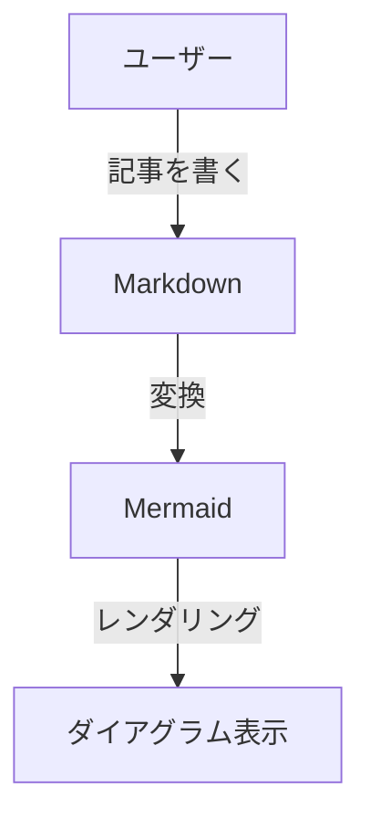

# 技術ブログにMermaidダイアグラムを導入した話【はてなブログ・DEV.to・Next.js対応】

## はじめに

技術記事を書く時、フローチャートやシーケンス図があると格段に分かりやすくなりますよね。

今回、マルチプラットフォーム対応の技術ブログで**Mermaid記法**によるダイアグラム表示に対応したので、その実装方法を紹介します！

対応したプラットフォーム：
- 📝 **はてなブログ** - カスタムJavaScriptで対応
- 🌐 **DEV.to** - Mermaidを画像に変換して投稿
- ⚡ **Next.js（Vercel）** - クライアントサイドレンダリング

## Mermaidとは？

Mermaidは、テキストベースでダイアグラムを描けるJavaScriptライブラリです。

**記述例:**


シンプルなテキストで、こんな感じの図が描けます。めっちゃ便利！

## 各プラットフォームの対応方法

### 1. はてなブログでの対応

はてなブログは標準でMermaidをサポートしていないため、**カスタムJavaScript**で対応しました。

#### 実装手順

**1) はてなブログの管理画面で「設定」→「詳細設定」を開く**

**2) 「headに要素を追加」に以下を貼り付け:**

```html
<!-- Mermaidダイアグラムのスタイル設定 -->
<style>
  .mermaid {
    background-color: #ffffff !important;
    padding: 20px;
    border-radius: 4px;
    margin: 20px 0;
  }
  
  .mermaid svg {
    background-color: #ffffff !important;
  }
</style>

<!-- Mermaidダイアグラム表示用スクリプト -->
<script type="module">
  import mermaid from 'https://cdn.jsdelivr.net/npm/mermaid@11/dist/mermaid.esm.min.mjs';
  
  document.addEventListener('DOMContentLoaded', function() {
    mermaid.initialize({
      startOnLoad: true,
      theme: 'default',
      themeVariables: {
        background: '#ffffff'
      },
      securityLevel: 'loose'
    });
    
    document.querySelectorAll('pre code').forEach((codeBlock) => {
      const codeText = codeBlock.textContent || codeBlock.innerText;
      
      if (codeText.trim().startsWith('mermaid')) {
        const pre = codeBlock.parentElement;
        if (pre) {
          const lines = codeText.split('\\n');
          const mermaidCode = lines.slice(1).join('\\n').trim();
          
          const mermaidDiv = document.createElement('div');
          mermaidDiv.className = 'mermaid';
          mermaidDiv.textContent = mermaidCode;
          
          pre.replaceWith(mermaidDiv);
        }
      }
    });
    
    mermaid.run({
      querySelector: '.mermaid'
    });
  });
</script>
```

**3) 記事では以下のように書く:**

````markdown
```
mermaid
graph LR
    A --> B
```
````

> [!IMPORTANT]
> はてなブログでは ` ```mermaid ` という書き方ができないため、コードブロック内の最初の行に `mermaid` と書く必要があります。

#### ポイント

- ✅ **白背景を強制**: 暗い背景になる問題を解決
- ✅ **CDN経由**: 最新版のMermaidを自動で利用
- ✅ **一度設定すれば全記事に適用**

### 2. DEV.toでの対応

DEV.toは**Mermaidをネイティブサポートしていない**ため、画像に変換して投稿する方式を採用しました。

#### 実装（自動化）

Node.jsスクリプトで、記事投稿時に自動的にMermaidブロックを画像に変換します。

```javascript
// scripts/utils/mermaid-converter.mjs
import { execSync } from 'child_process';

export async function convertMermaidToImage(mermaidCode, outputPath) {
    const tempInputFile = `/tmp/mermaid-${Date.now()}.mmd`;
    
    fs.writeFileSync(tempInputFile, mermaidCode, 'utf8');
    
    // mermaid-cliで画像変換（背景は白色）
    execSync(
        `npx -y @mermaid-js/mermaid-cli@latest -i "${tempInputFile}" -o "${outputPath}" -b white`,
        { stdio: 'inherit' }
    );
    
    fs.unlinkSync(tempInputFile);
    return true;
}
```

**変換の流れ:**
1. Markdown内の ` ```mermaid ` ブロックを検出
2. `@mermaid-js/mermaid-cli`で画像（PNG）に変換
3. `public/images/diagrams/`に保存
4. Markdownを `` に置き換え

#### メリット

- ✅ DEV.toでも確実に表示される
- ✅ 画像なのでロード時間が速い
- ✅ ダークモードでも見やすい（白背景指定）

### 3. Next.js（Vercel）での対応

自サイト（Next.js）では、クライアントサイドでMermaidをレンダリングしています。

#### 実装

```tsx
// src/components/mdx/MermaidRenderer.tsx
'use client';

import { useEffect } from 'react';

export function MermaidRenderer() {
    useEffect(() => {
        async function initMermaid() {
            const mermaid = (await import('mermaid')).default;

            mermaid.initialize({
                startOnLoad: true,
                theme: 'default',
                themeVariables: {
                    background: '#ffffff', // ダークモードでも白背景
                },
                securityLevel: 'loose',
            });

            const codeBlocks = document.querySelectorAll('pre code.language-mermaid');
            codeBlocks.forEach((codeBlock, index) => {
                const pre = codeBlock.parentElement;
                if (pre) {
                    const code = codeBlock.textContent || '';
                    const wrapper = document.createElement('div');
                    wrapper.className = 'mermaid-diagram-wrapper';
                    wrapper.id = `mermaid-diagram-${index}`;
                    wrapper.textContent = code;
                    pre.replaceWith(wrapper);
                }
            });

            mermaid.run({
                querySelector: '.mermaid-diagram-wrapper',
            });
        }

        initMermaid();
    }, []);

    return null;
}
```

#### ダークモード対応（CSS）

```css
/* src/app/globals.css */
.mermaid-diagram-wrapper,
.mermaid-diagram-wrapper svg {
  background-color: #ffffff !important;
  padding: 20px;
  border-radius: 8px;
  margin: 20px 0;
}

/* ダークモードでは薄い枠線を追加 */
.dark .mermaid-diagram-wrapper {
  border: 1px solid #475569;
}
```

## 苦労した点と解決方法

### 問題1: 背景が暗くて見づらい

**症状:**
デフォルトのMermaidテーマだと、ダイアグラムの背景が暗い色になり、矢印や文字が見にくい。

**解決策:**
- `themeVariables.background: '#ffffff'`で強制的に白背景に
- CSSで`.mermaid`要素にも白背景を適用

### 問題2: ダークモードで真っ白すぎて浮く

**症状:**
ダークモードのページで白背景のダイアグラムが浮いて見える。

**解決策:**
```css
.dark .mermaid-diagram-wrapper {
  border: 1px solid #475569; /* 薄い枠線を追加 */
}
```

### 問題3: はてなブログで ` ```mermaid ` が使えない

**症状:**
はてなブログはコードブロックの言語指定に対応していない。

**解決策:**
コードブロック内の最初の行を `mermaid` にして、JavaScriptで判定する方式に変更。

## まとめ

Mermaidダイアグラムを3つのプラットフォームで表示できるようにした実装を紹介しました。

**ポイント:**
- 📝 **はてなブログ**: カスタムJSで動的レンダリング
- 🌐 **DEV.to**: CLIで事前に画像変換
- ⚡ **Next.js**: クライアントサイドレンダリング + ダークモード対応

各プラットフォームの特性に合わせた実装で、どこでも快適にダイアグラムが表示されるようになりました！

技術記事に図解を入れたい方の参考になれば嬉しいです 🎉

## 参考リンク

- [Mermaid公式ドキュメント](https://mermaid.js.org/)
- [Mermaid CLI](https://github.com/mermaid-js/mermaid-cli)
- [はてなブログのカスタマイズ](https://help.hatenablog.com/)

---

*この記事の図解もすべてMermaidで作成されています！*
